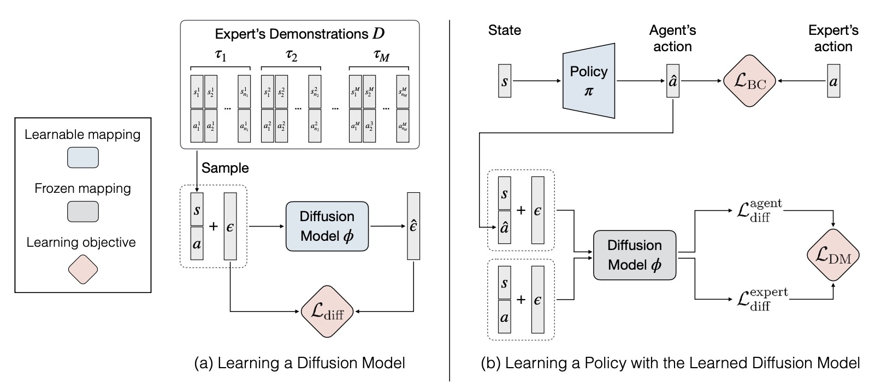

# Diffusion Model-Augmented Behavioral Cloning

[Hsiang-Chun Wang\*](https://openreview.net/profile?id=~Hsiang-Chun_Wang1),
[Shang-Fu Chen\*](https://openreview.net/profile?id=~Shang-Fu_Chen2),
[Ming-Hao Hsu](https://qaz159qaz159.github.io/),
[Chun-Mao Lai](https://www.mecoli.net/),
[Shao-Hua Sun](https://shaohua0116.github.io) at [NTU RLL lab](https://github.com/NTURobotLearningLab/)

[[Project website]](https://github.com/NTURobotLearningLab/dbc) [[Paper]](https://arxiv.org/abs/2302.13335)

<!-- TODO: Update publication list -->
This is the official PyTorch implementation of the paper ["Diffusion Model-Augmented Behavioral Cloning"](https://nturobotlearninglab.github.io/dbc/) (ICML2023 workshop).



## Installation

1. This code base requires `Python 3.7.2` or higher. All package requirements are in
   `requirements.txt`. To install from scratch using Anaconda, use the following
   commands.

```
conda create -n [your_env_name] python=3.7.2
conda activate [your_env_name]
pip install -r requirements.txt

cd d4rl
pip install -e .
cd ../rl-toolkit
pip install -e .

mkdir -p data/trained_models
```

2. Setup [Weights and Biases](https://wandb.ai/site) by first logging in with `wandb login <YOUR_API_KEY>` and then editing `config.yaml` with your W&B username and project name.

3. Download expert demonstration datasets to `./expert_datasets`. We include the expert demonstration datasets on [Google Drive](https://drive.google.com/drive/folders/15Ozv8SV41gdDviMZ67rZdF_RUiRr9Mi6?usp=sharing) and provide a script for downloading them.

```
python download_demos.py
```

## How to reproduce experiments
- For diffusion model pretraining, run `rl-toolkit/dm/ddpm.py`.
<!-- - For policy learning, run `dbc/main.py`, e.g., you can run the following command to run DBC on Maze environment: -->
- For policy learning, you can either run `dbc/main.py` for single experiment or run `./wandb.sh configs/<env>/<alg.yml>` to run a wandb sweep. 
<!-- `python dbc/main.py --seed 1 --prefix dbc --alg dbc --traj-load-path ./expert_datasets/maze2d_100.pt --ddpm-path [path-to-ddpm] --bc-num-epochs 2000 --coeff 5 --coeff-bc 1 --env-name maze2d-medium-v2 --eval-num-processes 1 --num-eval 100 --cuda True --num-render 3 --vid-fps 60 --lr 0.0001 --log-interval 200 --save-interval 20000 --eval-interval 2000 --hidden-dim 256 --depth 2 --clip-actions True --normalize-env False --bc-state-norm False --il-in-action-norm False --il-out-action-norm False` -->
- We have provided both methods to reproduce our result. Configuration files for policy learning of all tasks can be found at `configs`, and you can find the command for single experiment in `runs`.

We specify how to train diffusion models and the location of configuration files as following:

### Maze2D

- Ours:
    1. DM pretraining: `./runs/maze/train_dm.sh`
    2. Policy learning: `./runs/maze/dbc.sh` or `./wandb.sh ./configs/maze/dbc.yaml`
- BC: `./runs/maze/bc.sh` or `./wandb.sh ./configs/maze/bc.yaml`
- Implicit BC: `./runs/maze/ibc.sh` or `./wandb.sh ./configs/maze/ibc.yaml`
- Diffusion Policy: `./runs/maze/dp.sh` or `./wandb.sh ./configs/maze/dp.yaml`

### Fetch Pick

- Ours:
    1. DM pretraining: `./runs/fetchPick/train_dm.sh`
    2. Policy learning: `./runs/fetchPick/dbc.sh` or `./wandb.sh ./configs/fetchPick/dbc.yaml`
- BC: `./runs/fetchPick/bc.sh` or `./wandb.sh ./configs/fetchPick/bc.yaml`
- Implicit BC: `./runs/fetchPick/ibc.sh` or `./wandb.sh ./configs/fetchPick/ibc.yaml`
- Diffusion Policy: `./runs/fetchPick/dp.sh` or `./wandb.sh ./configs/fetchPick/dp.yaml`

### Hand Rotate

- Ours:
    1. DM pretraining: `./runs/hand/train_dm.sh`
    2. Policy learning: `./runs/hand/dbc.sh` or `./wandb.sh ./configs/hand/dbc.yaml`
- BC: `./runs/hand/bc.sh` or `./wandb.sh ./configs/hand/bc.yaml`
- Implicit BC: `./runs/hand/ibc.sh` or `./wandb.sh ./configs/hand/ibc.yaml`
- Diffusion Policy: `./runs/hand/dp.sh` or `./wandb.sh ./configs/hand/dp.yaml`

### Half Cheetah

- Ours:
    1. DM pretraining: `./runs/halfcheetah/train_dm.sh`
    2. Policy learning: `./runs/halfcheetah/dbc.sh` or `./wandb.sh ./configs/halfcheetah/dbc.yaml`
- BC: `./runs/halfcheetah/bc.sh` or `./wandb.sh ./configs/halfcheetah/bc.yaml`
- Implicit BC: `./runs/halfcheetah/ibc.sh` or `./wandb.sh ./configs/halfcheetah/ibc.yaml`
- Diffusion Policy: `./runs/halfcheetah/dp.sh` or `./wandb.sh ./configs/halfcheetah/dp.yaml`

### Walker

- Ours:
    1. DM pretraining: `./runs/walker/train_dm.sh`
    2. Policy learning: `./runs/walker/dbc.sh` or `./wandb.sh ./configs/walker/dbc.yaml`
- BC: `./runs/walker/bc.sh` or `./wandb.sh ./configs/walker/bc.yaml`
- Implicit BC: `./runs/walker/ibc.sh` or `./wandb.sh ./configs/walker/ibc.yaml`
- Diffusion Policy: `./runs/walker/dp.sh` or `./wandb.sh ./configs/walker/dp.yaml`

### Ant Goal

- Ours:
    1. DM pretraining: `./runs/antReach/train_dm.sh`
    2. Policy learning: `./runs/antReach/dbc.sh` or `./wandb.sh ./configs/antReach/dbc.yaml`
- BC: `./runs/antReach/bc.sh` or `./wandb.sh ./configs/antReach/bc.yaml`
- Implicit BC: `./runs/antReach/ibc.sh` or `./wandb.sh ./configs/antReach/ibc.yaml`
- Diffusion Policy: `./runs/antReach/dp.sh` or `./wandb.sh ./configs/antReach/dp.yaml`

## Code Structure

- `dbc`: method and custom environment code.
  - `rl-toolkit/rlf/algos/il/dbc.py`: Algorithm of our method
  - `rl-toolkit/rlf/algos/il/bc.py`: Algorithm of BC
  - `rl-toolkit/rlf/algos/il/ibc.py`: Algorithm of our Implicit BC
  - `rl-toolkit/rlf/algos/il/dp.py`: Algorithm of our Diffusion Policy
  - `d4rl/d4rl/pointmaze/maze_model.py`: Maze2D task
  - `dbc/envs/fetch/custom_fetch.py`: Fetch Pick task.
  - `dbc/envs/hand/manipulate.py`: Hand Rotate task.
  - `download_demos.py`: script to generate demonstrations of our environments.
- `rl-toolkit`: base RL code and code for imitation learning baselines from [rl-toolkit](https://github.com/ASzot/rl-toolkit).
  - `rl-toolkit/algos/on_policy/ppo.py`: the PPO policy updater code we use for RL.
- `d4rl`: Codebase from [D4RL: Datasets for Deep Data-Driven Reinforcement Learning](https://github.com/rail-berkeley/d4rl) for Maze2D.

## Acknowledgement

- The Fetch and Hand Rotate environments are with some tweaking from [OpenAI](https://github.com/openai/gym/tree/6df1b994bae791667a556e193d2a215b8a1e397a/gym/envs/robotics)
- The Ant environment is with some tweaking from [DnC](https://github.com/dibyaghosh/dnc)
- The Maze2D environment is based on [D4RL: Datasets for Deep Data-Driven Reinforcement Learning](https://github.com/rail-berkeley/d4rl).
- The Walker2d environment is in [OpenAI Gym](https://github.com/openai/gym/blob/master/gym/envs/mujoco/walker2d_v3.py).

## Reference

This repo is based on the official PyTorch [implementation](https://github.com/clvrai/goal_prox_il) of the paper ["Generalizable Imitation Learning from Observation via Inferring Goal Proximity"](https://clvrai.github.io/goal_prox_il/)

## Citation

```
@article{wang2023diffusion,
  title={Diffusion Model-Augmented Behavioral Cloning},
  author={Wang, Hsiang-Chun and Chen, Shang-Fu and Hsu, Ming-Hao and Lai, Chun-Mao and Sun, Shao-Hua},
  journal={arXiv preprint arXiv:2302.13335},
  year={2023}
}
```


<!-- # TODO
- test env installation